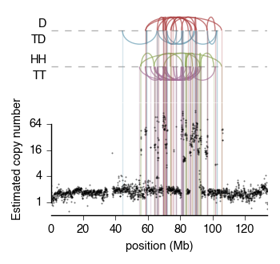
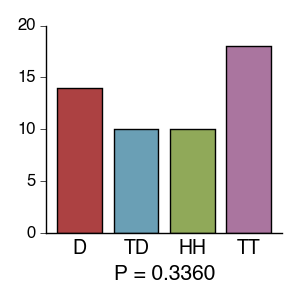
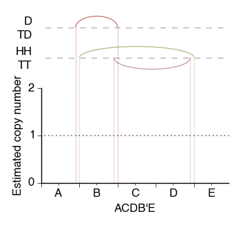

The module `sv_tools` contains a few tools for plotting and reasoning
about genomic structural variants. This code was used in the paper

Garsed, D.W., Marshall, O.J., Corbin, V.D.A., Hsu, A., Di Stefano, L.,
Schröder, J., Li, J., Feng, Z.-P., Kim, B.W., Kowarsky, M., et al.
(2014). [*The Architecture and Evolution of Cancer
Neochromosomes*](http://www.cell.com/cancer-cell/abstract/S1535-6108%2814%2900373-0).
Cancer Cell 26, 653–667.

### Examples

-   `sv_diagram` contains code to plot structural variant diagrams, in
    the style of Li, Y., Schwab, C., Ryan, S.L., Papaemmanuil, E.,
    Robinson, H.M., Jacobs, P., Moorman, A.V., Dyer, S., Borrow, J.,
    Griffiths, M., et al. (2014). [*Constitutional and somatic
    rearrangement of chromosome 21 in acute lymphoblastic
    leukaemia*](http://www.ncbi.nlm.nih.gov/pubmed/24670643). Nature 508,
    98–102.

    An example showing chromosome 12 of the ST059 cell line:

    

    This was generated by

    ```{.python}
    from sv_tools import sv_data, sv_diagram

    cn_file = "sv_tools/sample_data/ST059_5kb_bins_CN_thinned.bed"
    fusion_file = "sv_tools/sample_data/ST059_breakpoints.txt"
    chrom = "chr12"

    # To save as .pdf, simply change the extension below
    outfile = "sv_tools/sample_data/sv_diagram_ST059_chr12.png"
    xlabel = "position (Mb)"

    x, cn = sv_data.get_x_cn(cn_file, chrom)
    fusions = sv_data.get_fusions(fusion_file, chrom)

    sv_diagram.plot_sv_diagram(
        x, cn, fusions,
        outfile = outfile,
        # The arguments below are optional:
        xlabel = xlabel,
        logbase = 4,
        ymin = 0.5,
        ymax = 200,
        yticks = [1,4,16,64]
        )
    ```

    The copy number data has been "thinned" to reduce the size of the sample dataset.

-   `kc_tests` implements a couple of the tests described in Korbel, J.O.,
    and Campbell, P.J. (2013). [*Criteria for Inference of Chromothripsis
    in Cancer
    Genomes*](http://www.cell.com/abstract/S0092-8674%2813%2900212-2).
    Cell 152, 1226–1236.

    An example of test "E1" from the paper, applied to chromosome 12
    of the ST059 cell line:

    

    This was generated by

    ```{.python}
    from sv_tools import sv_data, kc_tests

    fusion_file = "sv_tools/sample_data/ST059_breakpoints.txt"
    fusions = sv_data.get_fusions(fusion_file, chrom)

    kc_tests.test_E1(
                fusions,
                "sv_tools/sample_data/kc_test_e1_ST059_chr12.png"
                )
    ```

-   `identifiability` and `simulator` contain code for exploring how
changes in donor chromosomes show up in the plots produced by
`sv_diagram`. They're not so well-documented as the other
submodules. Donor chromosomes are represented using strings like
`AABD'E`, where `'` denotes reverse complement, and `ABCDE` represents
the unrearranged chromosome.

    An example structural variant diagram for the donor chromosome
    `ACDB'E`:

    

    This was generated by

    ```{.python}
    from sv_tools import simulator

    simulator.simulate_sv_diagram(
                        "ACDB'E",
                        "sv_tools/sample_data/simulation_ACDB'E.png"
                        )
    ```

### Requirements and installation

The scripts work in Python 2.7.10 and make use of `matplotlib`,
`pandas`, `numpy`, `scipy`, and `networkx` (as well as standard
modules like `re` and `itertools`).

The module can be installed by running `python setup.py install`.
